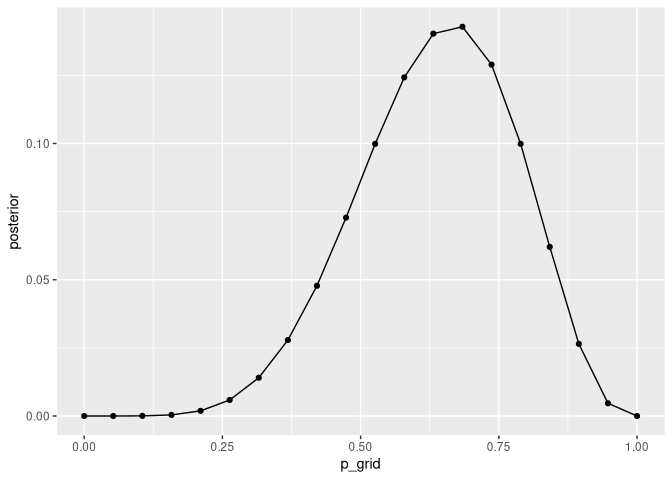
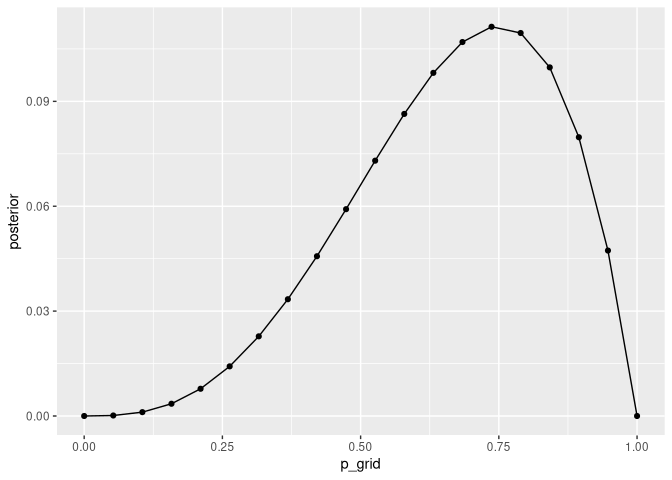
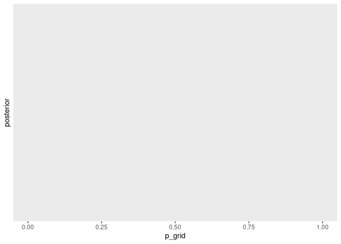

# The Golem of Praque
Max Hachemeister
2026-02-26

- [2E4.](#2e4)
- [2M1.](#2m1)
- [2M2.](#2m2)
- [2M3.](#2m3)
- [2M4](#2m4)

``` r
library(tidyverse)
```

### 2E4.

> What does it mean to say: “The probability of water is ‘0.7’.”?

Probability does not exist. So a water probability of 0.7 does not mean
that the globe’s actual proportion of water is 0.7. It means more
something like: “Given what I know, I am 70% certain that I will see
water with the next globe toss.”; or “In 70% of the globe tosses water
will be observed.”

### 2M1.

> Compute and plot the grid approximate posterior distribution for each
> of the following sets of observations. In each case, assume a uniform
> prior for $p$.
>
> 1.  W, W, W
> 2.  W, W, W, L
> 3.  L, W, W, L, W, W, W

This is to be done with programming.

#### This is the workflow as copied from the book.

First, calculate the values:

``` r
#define grid
p_grid <- 
  seq(from = 0, to = 1, length.out = 20)

#define prior
prior <- 
  rep(1, 20)

#compute likelihood at each value in grid
likelihood <- 
  dbinom(6, size = 9, prob = p_grid)

#compute compute product of likelihood and prior
unstd.posterior  <- 
  likelihood * prior

# standardize the posterior, so it sums to 1
posterior <- 
  unstd.posterior / sum(unstd.posterior)
```

Then plot:

``` r
# Put it in tibble
data <- 
  tibble(
    p_grid,
    prior,
    likelihood,
    unstd.posterior,
    posterior
  )

data |> 
  ggplot(aes(p_grid, posterior)) +
  geom_point() +
  geom_line()
```


#### This is the solution to the task

Now, what needs to be changed in the above cases are the values for the
binomial distribution according to the sample observed. As we have
defined water as *success* and we have observed “W, W, W”, we tell the
function that there were three successes out of a samplesize of three,
and then ask how likely this observation would have been, given the
actual distribution of water and land were each to the values in the
`p_grid`. So we ask, what’s the most likely actual distribution of water
and land, that the observed sample could have resulted from.

Let’s do them sequentually and maye you will see. I will reuse the
tibble we already made, and just change the `likelihood`

##### W, W, W

``` r
data |> 
  mutate(
    likelihood = dbinom(3, size = 3, prob = p_grid)
  ) |> 
  ggplot(aes(p_grid, posterior)) +
  geom_point() +
  geom_line()
```



Ah well, the joke’s on me. I need to have the other values recomputed
also. So while I think I could write that up in a function, I will do it
copy & paste but do the tibble and plot in the same step

``` r
# make it a tibble
tibble(
  p_grid           = seq(from = 0, to = 1, length.out = 20),
  prior            = rep(1, 20),
  # this here is the thing that changes
  likelihood       = dbinom(3, size = 4, prob = p_grid),
  unstd.posterior  =  likelihood * prior,
  posterior        = unstd.posterior / sum(unstd.posterior)
) |> 
  #plot it
  ggplot(aes(p_grid, posterior)) +
  geom_point() +
  geom_line()
```


##### W, W, W, L

``` r
# make it a tibble
tibble(
  p_grid           = seq(from = 0, to = 1, length.out = 20),
  prior            = rep(1, 20),
  # this here is the thing that changes
  likelihood       = dbinom(3, size = 4, prob = p_grid),
  unstd.posterior  =  likelihood * prior,
  posterior        = unstd.posterior / sum(unstd.posterior)
) |> 
  #plot it
  ggplot(aes(p_grid, posterior)) +
  geom_point() +
  geom_line()
```



##### L, W, W, L, W, W, W

``` r
# make it a tibble
tibble(
  p_grid           = seq(from = 0, to = 1, length.out = 20),
  prior            = rep(1, 20),
  # this here is the thing that changes
  likelihood       = dbinom(5, size = 7, prob = p_grid),
  unstd.posterior  =  likelihood * prior,
  posterior        = unstd.posterior / sum(unstd.posterior)
) |> 
  #plot it
  ggplot(aes(p_grid, posterior)) +
  geom_point() +
  geom_line()
```



### 2M2.

> Compute the above again, this time with the following different priors
> for $p$: - 0 for $p$ \< 0.5, else uniform

Okay, the same as above, but the prior will be the following:

``` r
ifelse(p_grid < 0.5, 0, 1)
```

     [1] 0 0 0 0 0 0 0 0 0 0 1 1 1 1 1 1 1 1 1 1

And then just rinse and repeat. I mean I could probably device a
function that does that more elegantly, but I just want to understand
the bayesian concept at the moment rather than work on my coding skills.
The code won’t be echoed.


Okay, it does not look like much, but from what I can see, the
probability masses are higher now for all non-zero values, meaning that
there is more confidence for those values, leaving aside the question
whether our prior was factually correct.

### 2M3.

> Suppose there are two globes, one for Earth and one for Mars. The
> Earth globe is 70% covered with water. The Mars globe is 100% land.
> Further suppose that one of these globes – you don’t know which – was
> tossed in the air and produced a “land” observation. Assume that each
> globe was equally likely to be tossed. Show that the posterior
> probability that the globe was the Earth, conditional on seeing “land”
> (Pr(Earth\|land)), is 0.23.

Okay so, the land coverages are known, and both globes are equally
likely to be tossed, hence 50/50.

Let’s spell everything out that I know:

- $Pr(Earth)      = 0.5$
- $Pr(Mars)       = 0.5$
- $Pr(land|Mars)  = 1$
- $Pr(land|Earth) = .3$

Now let’s look at the Bayes theorem:

$$Pr(Earth|land) = \frac{Pr(land|Earth)Pr(Earth)}{Pr(land)}$$ To spell
it out: The probability of Earth given a land observation is the
probability to find land on earth times the probability to land on Earth
in general, per overall probability to find land.

And the overall probability of land is:

$$Pr(land) = Pr(land|Earth)Pr(Earth) + Pr(land|Mars)Pr(Mars)$$

Which spells out to: The probability to get land in any toss is the
probability to get land on Earth times the probability to get earth,
plus the probability to get land on Mars times the probability to get
Mars.

So let’s bring it together:

$$ Pr(Earth|land) = \frac{0.3 * 0.5}{0.3 * 0.5 + 1 * 0.5} $$

Let’s see what R makes out of this

``` r
pr_earth_land <- 
  (0.3 * 0.5) / (0.3 * 0.5 + 1 * 0.5)

pr_earth_land
```

    [1] 0.2307692

Okay, so:

$$ Pr(Earth|land) \approx 0.23 $$

Yeah, so what got me confused was that the bayes theroem omits the the
part to get to the overall probability of land. This got me thinking.
But yeah, I will probably still nee a while to wrap my head around this
way of thinking, but at least I was able to apply the equation.

### 2M4

> Suppose you have a deck with only three cards. Each card has two
> sides, and each side is either black or white. One card has two black
> sides. The second card has one black and one white side. The third
> card has two white sides.
>
> Now suppose all three cards are placed in a bag and schuffled. Someone
> reaches into the bag and pulls out a card and places it flat on a
> table. A black side is shown facing up, but you don’t know the color
> of the side facing down.
>
> Show that the probability that the other side is also black is 2/3.
> Use the counting method to approach this problem. This means counting
> up the ways that each card could produce the observed data (a black
> side facing up on the table).

Okay so here is what I know:

I call the cards A, B, and C; and the colors b, and w.

- A = b/b

- B = b/w

- C = w/w

- The probability of any card is 1/3

- The probability of any side of any card is 1/2

I have observed a black side and I want to know the probability of the
other side being black as well, so the probability of having card A,
which would be:

$$Pr(A|b)$$ Now this time I am supposed to count the possible ways each
card could give me a black side.

In the book is was presented as a table where on the left side were the
possible proportions of, in our case, black and white; and on the right
side were the ways to produce the observation.

As were specifically looking for a card that is black on both sides, the
table would look something like this:

| Conjecture | Ways to produce b/b |
|------------|---------------------|
| b/b        | 1                   |

…

Ahh actually it is about an estimation, of how probable it is that the
other side is black aswell. So I guess this can be regarded as separate
draws in which the ways to produce something change. Let’s start with
just the first draw showing a black side:

| Conjecture | Ways that ‘conjecture’ produced b |
|------------|-----------------------------------|
| b/b        | 2                                 |
| b/w        | 1                                 |
| w/w        | 0                                 |

Now lets count the ways to get a black side at first and then a black
side after the flip:

| Conjecture | Ways to produce b/b |
|------------|---------------------|
| b/b        | 1                   |
| b/w        | 0                   |
| w/w        | 0                   |

Ahh, this does not help much…

After checking the section in the book again, I can just pick up at the
first step. I got confused, because flipping the card would not be an
independent observation anymore, and I was thinking about that pretty
hard. But no, The first step is fine. We just ask, how likely is it that
the card we have drawn with a black side up, is actually the card with
the two black sides. So once again, back to the table above:

| Conjecture | Ways that ‘conjecture’ produced b |
|------------|-----------------------------------|
| b/b        | 2                                 |
| b/w        | 1                                 |
| w/w        | 0                                 |

Now to get to the probability the counts need to be related with each
other. So we take the sum of the ways b could have been produced and
relate the indiviual ways of the cards with that sum. Let’s do this in
R:

``` r
# I'll make a tibble for that
  tibble(
    cards = c("b/b", "b/w", "w/w"),
    ways_b = c(2, 1, 0),
    plausibility = (ways_b / sum(ways_b)),
    numerator = ways_b %% sum(ways_b),
    denominator = sum(ways_b)
  )
```

    # A tibble: 3 × 5
      cards ways_b plausibility numerator denominator
      <chr>  <dbl>        <dbl>     <dbl>       <dbl>
    1 b/b        2        0.667         2           3
    2 b/w        1        0.333         1           3
    3 w/w        0        0             0           3

Yeah, I get the efficiency of doing these things with just vectors and
lines. I will do this aswell:

``` r
cards <-
  c("b/b", "b/w", "w/w")

ways_b <- 
  c( 2, 1, 0)

ways_b <- 
  setNames(ways_b, cards)
    
plausibility <- 
  (ways_b / sum(ways_b))

denominator <-  
  sum(ways_b)

numerator <- 
  ways_b %% denominator

plaus_results <- 
  rbind(numerator, denominator)

plaus_results
```

                b/b b/w w/w
    numerator     2   1   0
    denominator   3   3   3

Ah actually, let’s do it just logically.

So the sum of the ways b could have came to be is 3, and the ways b
could have come up from the card b/b is 2. So that’s it: There are 2/3
Ways, that the b/b card could have been drawn and turned up with a black
side.

That’s tricky, but a good practice, because the second side of the cards
has nothing to do with a follow up draw, but it’s important to how the
first observation could have come to be.
